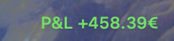
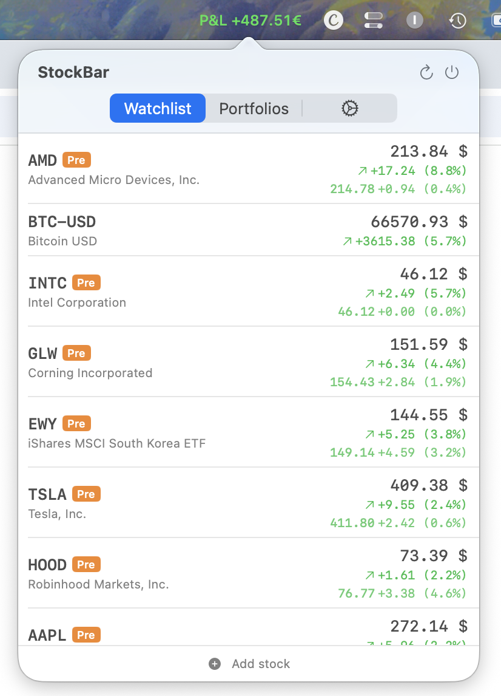
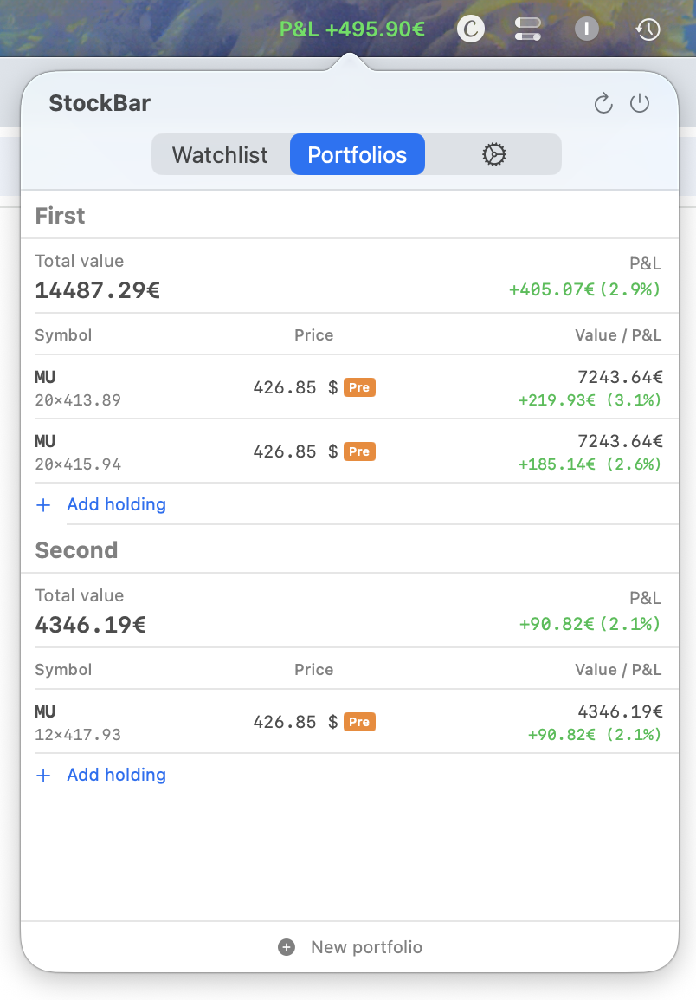
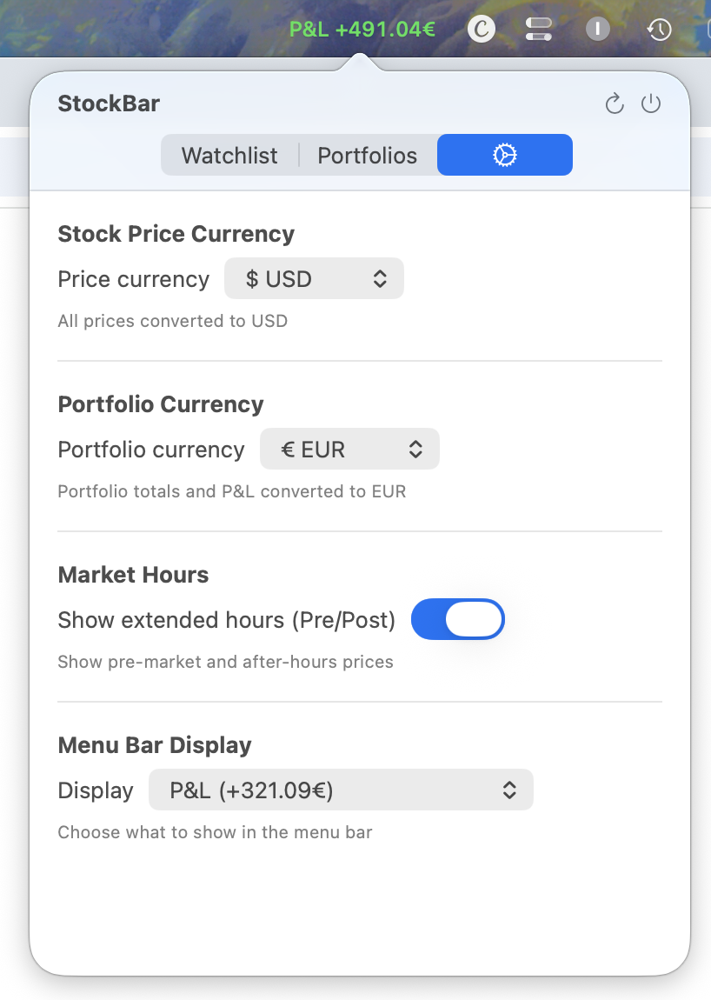

# StockBar

A lightweight macOS menu bar app for tracking stocks and portfolios in real time.

Built with SwiftUI. No account required, no API keys needed — data comes directly from Yahoo Finance.

## Screenshots

| Menu Bar | Watchlist | Portfolios | Settings |
|---|---|---|---|
|  |  |  |  |

## Features

- **Menu Bar P&L** — See your portfolio performance at a glance, always visible
- **Watchlist** — Track any stock by symbol with live prices and daily change
- **Portfolios** — Create multiple portfolios with holdings, average cost, and P&L
- **Extended Hours** — Pre-market and after-hours prices with PRE/POST badges
- **Currency Conversion** — Convert stock prices and portfolio values to your preferred currency
- **Customizable Menu Bar** — Choose what to display: P&L, total value, percentages, best/worst stock, or just an icon

## Install

### Build from source

Requires **Xcode 15+** and **macOS 14 Sonoma** or later.

```bash
git clone https://github.com/simonsruggi/StockBar.git
cd StockBar
swift build -c release
```

The binary will be at `.build/release/StockBar`.

To create an app bundle and install:

```bash
xcodebuild -scheme StockBar -configuration Release -destination 'platform=macOS' -derivedDataPath .build/xcode build
cp .build/xcode/Build/Products/Release/StockBar /Applications/StockBar.app/Contents/MacOS/StockBar
```

### Run

Double-click `StockBar.app` or:

```bash
open /Applications/StockBar.app
```

The app runs in the menu bar — look for the chart icon (or your chosen display) in the top-right of your screen. Click it to open the popover.

## Usage

### Watchlist

Add stocks by clicking **Add stock** at the bottom of the Watchlist tab. Search by symbol or company name (e.g. `AAPL`, `Tesla`). Stocks show:

- Current price with currency symbol
- Daily change (absolute and percentage)
- Extended hours price when available (PRE/POST badge)

Right-click a stock to remove it.

### Portfolios

1. Click the **Portfolios** tab
2. Click **New portfolio** to create one
3. Click **Add holding** to add a stock with quantity and average price

Each portfolio shows:
- **Total value** in your chosen currency
- **P&L** (profit & loss) in absolute and percentage terms
- Per-holding breakdown with price, value, and individual P&L

Right-click a holding to edit or delete it.

### Settings

Click the gear icon tab to configure:

| Setting | Description |
|---|---|
| **Stock Price Currency** | Convert all displayed prices to a single currency, or keep original |
| **Portfolio Currency** | Base currency for portfolio totals and P&L (EUR, USD, GBP, CHF, JPY, CAD, AUD) |
| **Show Extended Hours** | Toggle pre-market and after-hours prices on/off — affects prices, P&L, and menu bar |
| **Menu Bar Display** | What appears in your menu bar (see below) |

### Menu Bar Display Options

| Option | Example |
|---|---|
| P&L | `P&L +321.09€` |
| P&L % | `P&L +2.3%` |
| P&L + % | `+321.09€ (+2.3%)` |
| Total Value | `14396.67€` |
| Best Stock | `AAPL +1.2%` |
| Worst Stock | `TSLA -0.8%` |
| Best & Worst | `▲AAPL +1.2%  ▼TSLA -0.8%` |
| Icon Only | Chart icon |

Best/Worst are based on daily change % from your watchlist.

## Data

- Prices refresh automatically every 5 seconds
- All data is stored locally in `~/Library/Application Support/StockBar/data.json`
- No data is sent anywhere — the app only talks to Yahoo Finance APIs
- Exchange rates are fetched live for currency conversions

## Tech Stack

- Swift 5.9 / SwiftUI
- macOS 14+ (Sonoma)
- Yahoo Finance API (v7 quotes + v8 chart)
- No dependencies

## License

MIT
